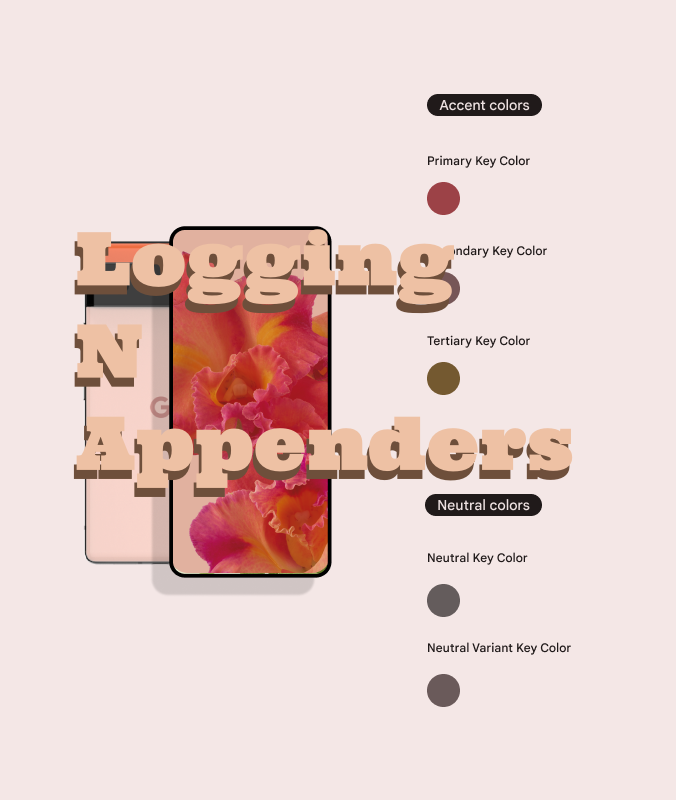

# logging_n_appenders

Logging N Appendeers is a project to show the best practices in logging for your Flutter app development process. The two packages you will master with this project is the logging package:

[Logging](https://pub.dev/packages/logging)

And the logging appenders package:

[Logging Appenders](https://pub.dev/packages/logging_appenders)

## The Medium Article

Here is the free link to the medium article:

[Mastering Flutter Logging, The Best Practice Way]()

And you should sign up for my Email newsletter at my medium blog:

[Fred Grott's Medium Blog](https://fredgrott.medium.com)

## References

Docs for the logging package:

[Docs for the logging package](https://pub.dev/packages/logging)

Docs for the Logging Appenders Package:

[Docs for the Logging Appenders package](https://pub.dev/packages/logging_appenders)

And the two remote logging services you can configure with the Logging Appenders package are:

[Logz io](https://logz.io/)

[loki](https://grafana.com/oss/loki/)

## About Fred Grott

Hi there, this is Fred Grott. I recently re-booted my life by getting control of my ADHD through such things as creating a note taking system using VSCode and ZettleKatsen note taking systems. 

My goal here is to bootstrap myself into mastering Flutter app development while at the same time teach you the expert fltter best practices that are not in the flutter docs.

Lets make Flutter Apps Awesome!

You can follow me on:

[Fred Grott at keyBase](https://keybase.io/fredgrott)

[Fred Grott at Twitter](https://twitter.com/fredgrott)

[Fred Grott at GitHub](https://github.com/fredgrott)

